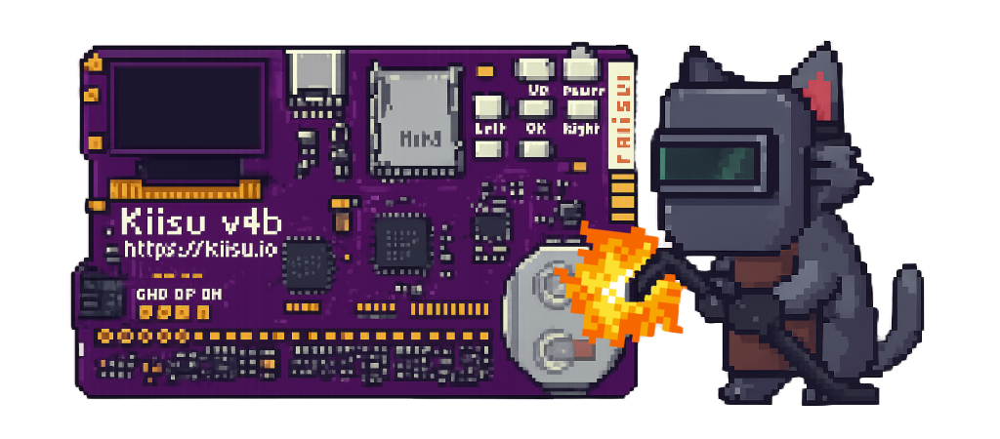
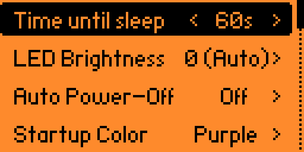

# Kiisu Manager

Configure and manage Kiisu aux MCU settings from your Flipper.
---

## Features

  

- **Time until sleep:** `Always ON` … `30 min`  
- **LED Brightness:** `Auto` or `5% … 100%` (5% steps)  
- **Auto Power-Off:** `Off`, `15s`, `30s`, `1m`, `5m`, `10m`, `30m`, `60m`  
- **Startup Color:** `Purple`, `Off`, `Red`, `Green`, `Blue`, `Yellow`, `Cyan`, `Magenta`, `White`  
- **Charge Rainbow:** `On` / `Off`

## Note for Momentum users
Auto PowerOFF is already an option in Momentum. I suggest you turn OFF the auto poweroff option in kiisu manager and keep the one in flipper settings on.

---

**Make sure your Kiisu is on the latest [companion firmware](https://github.com/twoelw/enhanced-kiisu4-fw/releases) for it to work!**
